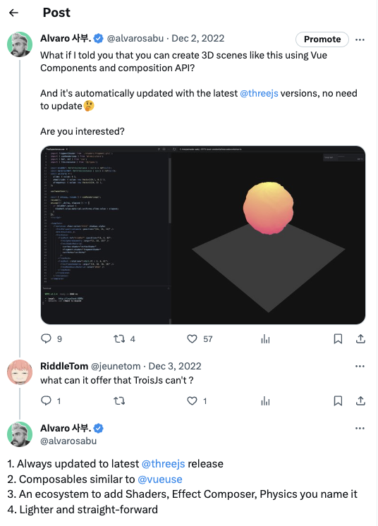

import StatusQuo from '../../components/StatusQuo.vue';

A year ago, I was learning how to use React Three Fiber, a custom renderer with the power of creating 3D scenes declarately with React components and it blowed my mind 🤯. 

Then, I did what I do best, complain in twitter 😅 😂:


Yep, that was the panorama for VueJS developers like me back then. There were some initiatives like TroisJS, a manual wrapper of ThreeJS for VueJS that became unmantained and Lunchbox, who were the firsts to try to create a renderer. But, it was not enough for me, inspired by Pmndrs work and Thretle for Svelte I decided to create a renderer for VueJS, and that's how TresJS was born.

I started with a simple idea, provide the vue community with a ecosystem that would allow you to create 3D scenes declaratively with VueJS components and that was easy to mantain and extend.



For us it was important to solve the biggest problems of previous solutions:

- Keep it up to date with ThreeJS which constantly updates
- A good DX, we wanted to make it easy to use and learn
- Performant, even with reactivity. 
- Extendable, we wanted to make it easy to create new components and extend the core library with community-driven packages.
  

Although v1 was a decent solution 😄 and we managed to achieve some of the goals, it has some limitations that would only be solved by using [Vue's Custom Renderer API](https://vuejs.org/api/custom-renderer.html).

## Roadmap to v2

<iframe src="https://giphy.com/embed/AXorq76Tg3Vte" class="w-full aspect-video" frameBorder="0" class="giphy-embed" allowFullScreen></iframe><p><a href="https://giphy.com/gifs/classic-film-leslie-caron-AXorq76Tg3Vte">via GIPHY</a></p>

Getting started with the Custom Renderer API was not easy, it's a very powerful API but it's not completly documented and it's not easy to find examples. We had to learn how to use it by reading the source code of VueJS and how the framework uses it internally to render the DOM `@vue/runtime-dom`.

Thats when [Verekia](https://twitter.com/verekia) author of [WebGameDev](https://www.webgamedev.com/) and one of our earliest supporters, put me in contact with [Cody Bennet](https://twitter.com/Cody_J_Bennett) and Paul Henschel ([0xca0a](https://twitter.com/0xca0a)) who are not more no less than the creators of React Three Fiber. They were very kind and helped me a lot with the fundations of the project and Cody did a small PoC replicating the React Three Fiber custom renderer but with the VueJS API.

*Voilà*! We had a working prototype of a custom renderer for VueJS, thanks to that example, I was able to understand how the API works and how to develop it further to assemble the scene graph based on nodes using `insert`, `patchProp` and `createElement` methods.

```ts
// core/renderer.ts
import * as THREE from 'three'

import { createRenderer } from 'vue'
import { extend } from './catalogue'
import { nodeOps } from './nodeOps'

export const { render } = createRenderer(nodeOps)

// Creates the catalogue of components based on THREE namespace
extend(THREE)

export default { extend }
```

where the `nodeOps` are the methods that the renderer uses to create the scene graph and patch the props of the nodes.

```ts
// core/nodeOps.ts
export const nodeOps: RendererOptions<TresObject, TresObject> = {
  createElement(tag, _isSVG, _anchor, props) {
    // Matches tags with the catalogue of THREE constructors with arguments and returns the instance
  },
  insert(child, parent) {
    // Adds the instance to the scene graph
  },
  remove(node) {
    // Removes the instance from the scene graph and dispose it from memory
  },
  patchProp(node, prop, _prevValue, nextValue) {
    // Handles props
  },
}
```

With a `<TresCanvas />` component, we were able to provide a context for the custom renderer, a catalogue of instances from Three namespace, a state and a scene graph that would be shared across the ecosystem using `provide` and `inject` API. 

```ts
// TresCanvas.vue

const createInternalComponent = (context: TresContext) =>
  defineComponent({
    setup() {
      const ctx = getCurrentInstance()?.appContext
      if (ctx) ctx.app = instance as App
      provide('useTres', context)
      provide('extend', extend)
      return () => h(Fragment, null, slots?.default ? slots.default() : [])
    },
  })

const mountCustomRenderer = (context: TresContext) => {
  const InternalComponent = createInternalComponent(context)
  render(h(InternalComponent), scene.value as unknown as TresObject)
}

onMounted(() => {
  const existingCanvas = canvas as Ref<HTMLCanvasElement>

  context.value = useTresContextProvider({
    scene: scene.value,
    canvas: existingCanvas,
    windowSize: props.windowSize,
    disableRender,
    rendererOptions: props,
  })
  mountCustomRenderer(context.value)
})
```

## Core Team assembly


Soon after, [Jaime Torralba](https://twitter.com/jaimebboyjt) and [Tino](https://twitter.com/ichbintino) joined the core-team. Jaime took the lead of the abstractions and helpers on the [`cientos` package](https://cientos.tresjs.org/), providing the ecosystem with really cool demos, and Tino contributed heavily on the stability of the core, creating a context provider for the state and everything related to pointer events and raycasting.

[andretchen0](https://github.com/andretchen0) joined the team later after collaborating heavily extending `cientos` with new components and helpers that literally blowed our minds off 🤯.

They are the heart of the project and without them, TresJS would not be what it is today 💚.

## Open Source at VueJS London

Until this point, TresJS was a private repository. We were not sure if the project was going to be successful or not, but we were sure that we wanted to make it open source. So we decided to make it public live on stage at [VueJS Live London](https://vuejslive.com/).

Funny enough, Github gave us a really hard time with authentication to make it public, you know, the magic of live stage. 😅

<iframe class="w-full rounded aspect-video" src="https://www.youtube.com/embed/-Ri7VZzhhUo?si=ABoRnD225DGeVeM8&amp;start=1193" title="YouTube video player" frameborder="0" allow="accelerometer; autoplay; clipboard-write; encrypted-media; gyroscope; picture-in-picture; web-share" allowfullscreen></iframe>

## Status Quo

A year after, we have a stable ecosystem that allow you to create 3D scenes declaratively with VueJS. We have a lot of cool demos and people using TresJS already in production for webistes and, games 🕹️.

<StatusQuo client:only />


